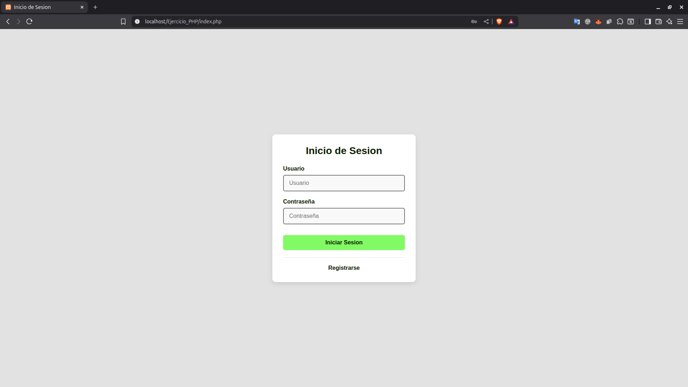
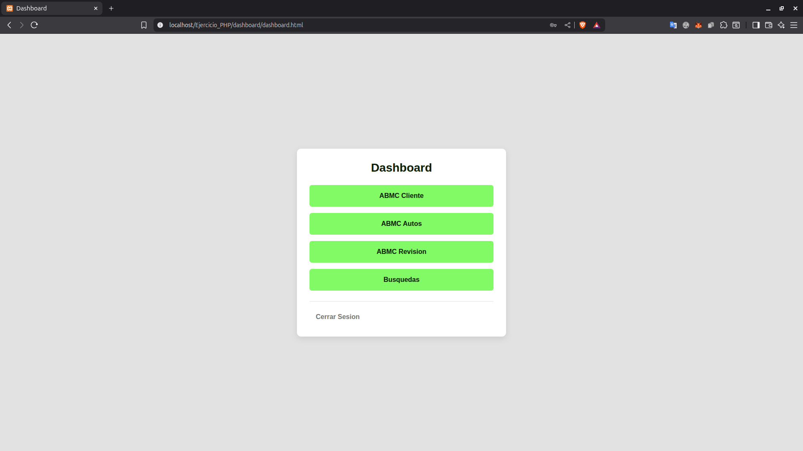
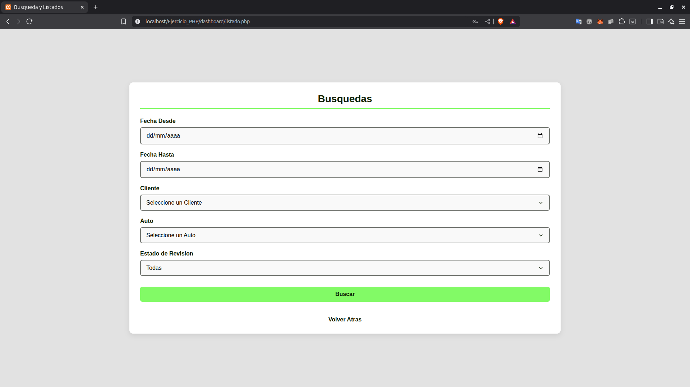
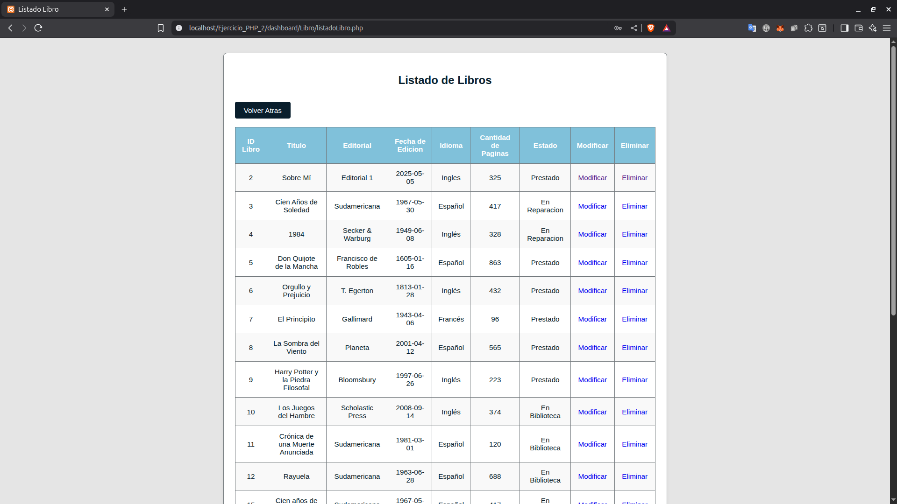

# EJERCIOS DE PHP + MySQL

Este repositorio contiene ejercicios prácticos desarrollados con **PHP**, **HTML**, **CSS** y **MySQL**. Están diseñados para reforzar habilidades en desarrollo web y bases de datos.

---

## 📁 ESTRUCTURA DEL REPOSITORIO

`php/` => Contiene el codigo fuente divido por ejercicios
`docs_php/` => Contiene los archivos PDF con los ejercicios
`img_php/` => Captura de pantalla de los ejercicios

---

## 💾 BASES DE DATOS INCLUIDAS

Cada carpeta de ejercicios de `php/` incluye un archivo `.sql` con la **estructura de la base de datos utilizada**.  
Se puede importar fácilmente desde **phpMyAdmin** o cualquier otro cliente MySQL.

**Ubicación de los archivos `.sql`:**

- `/php/Ejercicio_PHP/bd` => Base de datos para el sistema de gestión de automóviles  
- `/php/Ejercicio_PHP_2/bd` => Base de datos para el sistema de gestión de biblioteca

---

## 📸 CAPTURAS DE PANTALLA

---

## 📄 EJERCICIOS EN PDF

-[Ejercicio 1](docs_php/Ejercicio1_PHP_MySQL.pdf)
Sistema de **Gestion de Automoviles** que permite registrar, listar, modificar y eliminar automóviles. Incluye login de usuario y validaciones.

-[Ejercicio 2](docs_php/Ejercicio2_PHP_MySQL.pdf)
Sistema de **Gestion de Biblioteca** que permite el alta, modificación, eliminación y consulta de libros. También cuenta con inicio de sesión y validaciones.

---